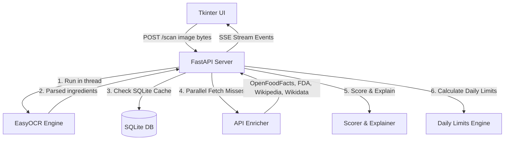

# 🔬 Food Detective Architecture

This document describes the high-level architecture of the **Food Detective** application.

---

## 1. Application Flow

The application combines a desktop client (Tkinter) and a lightweight local server (FastAPI) running in the same process space but on separate threads:

---

## 2. Core Modules

### 2.1 OCR Preprocessing (`modules/ocr.py`)
To achieve high accuracy on camera-captured photos (which contain shadows, noise, and glare), the image is preprocessed before being sent to EasyOCR:
* **Autofocus & Zero Buffer Lag**: Set on the webcam frame capture to prevent motion blur.
* **Bilateral Filtering**: Denoises flat areas while preserving sharp edges of text.
* **CLAHE (Local Contrast)**: Compensates for curved packaging surfaces and uneven lighting.
* **Laplacian Sharpening**: Blends high-pass filtered text edges back into the image.

### 2.2 API Enricher (`modules/enricher.py`)
Fetches data concurrently using `asyncio.gather` across four public endpoints:
1. **OpenFoodFacts**: Extracts additive tags, E-numbers, and vegan status.
2. **OpenFDA**: Retrieves aggregate food adverse reaction statistics.
3. **Wikipedia REST**: Fetches plain English summaries of compounds.
4. **Wikidata SPARQL**: Matches chemical identifiers to European E-numbers.

### 2.3 SQLite Cache (`modules/cache.py`)
Caches API enrichment queries locally in `data/ingredients.db` for **90 days** using a SQLite connection. Contains background garbage collection to purge expired records.

### 2.4 Scorer & Explainer (`modules/scorer.py`, `modules/explainer.py`)
* **Scorer**: Uses regular expressions with strict word boundaries to categorize ingredients into `safe`, `caution`, `avoid`, or `toxic`.
* **Explainer**: Formulates kid-friendly (ages 6–12) sentences explaining what each ingredient is and why it has its safety rating.

### 2.5 Daily Limits (`modules/daily_limits.py`)
Computes safe daily consumption counts based on WHO, EFSA ADI (Acceptable Daily Intake), and American Heart Association limits, adjusting thresholds for a reference 20 kg child.
